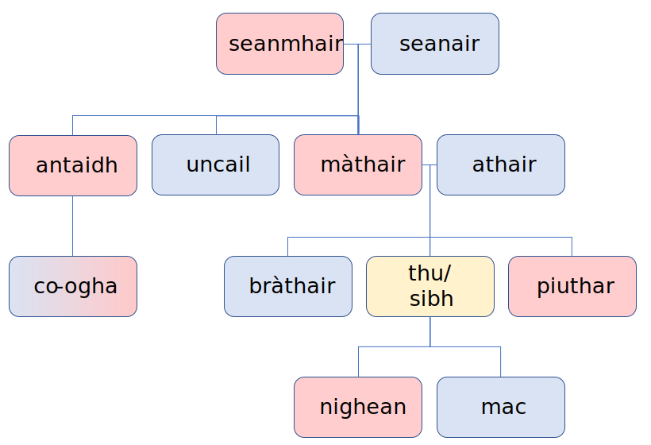

# Family

| English             | Gàidhlig  |
|---------------------|-----------|
| aunt                | antaidh   |
| brother             | bràthair  |
| cousin              | co-ogha   |
| daughter            | nighean   |
| father              | athair    |
| grandfather         | seanair   |
| grandmother         | seanmhair |
| mother              | màthair   |
| sister              | piuthar   |
| son                 | mac       |
| uncle               | uncail    |
| you (formal/plural) | sibh      |
| you (familiar)      | thu       |
